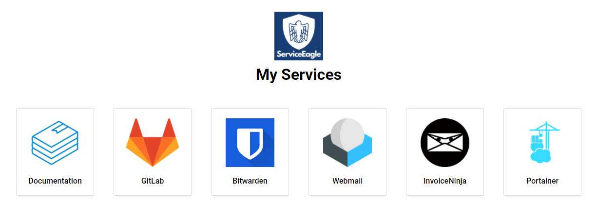

# ServiceEagle
## Description
Tool for the visualization of all important services and links of an organization.


## Installation with Docker
### Folder structure:
```
.
├── docker-compose.yml
└── links.json
```

### docker-compose.yml
```
version: '3.7'
services:
  service-eagle:
    restart: always
    image: tbd
    ports:
      - 8080:80
    environment:
      - PAGE_HEADER=My Services
      - PAGE_HEADER_ICON=/assets/logo/ServiceEagle.png
      - DATA_SOURCE=/assets/data/links.json
    volumes:
      - ./links.json:/usr/share/nginx/html/assets/data/links.json
```
### links.json
see `src/assets/`

### Environment Variables
#### Overview
```
- PAGE_HEADER
- PAGE_HEADER_ICON
- DATA_SOURCE
```

#### Descriptions
- [[ ENV_NAME (`default value`): description ]]
- PAGE_HEADER (`My Services`): header of the page; also sets the page title
- PAGE_HEADER_ICON (`/assets/logo/ServiceEagle.png`): header icon of the page; also sets the favicon
- DATA_SOURCE (`/assets/data/links.json`): url to links configuration file

## Building the docker container
`docker build - < Dockerfile`
